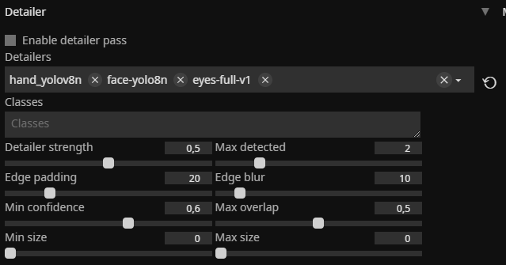
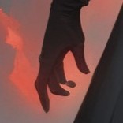

# Detailer

<figure><figcaption>
Надо включить галочку
</figcaption></figure>

Его можно включать и в Text2Img, но он замедляет работу, так что лучше использовать в конце.

<figure><figcaption>
Base
</figcaption></figure>

 

<figure><figcaption>
Img2Img + resize
</figcaption></figure>

 

<figure><figcaption>
Img2Img + resize + Detailer
</figcaption></figure>

<figure><figcaption>
Base
</figcaption></figure>

 

<figure><figcaption>
Img2Img + resize
</figcaption></figure>

 

<figure><figcaption>
Img2Img + resize + Detailer
</figcaption></figure>

<figure><figcaption>
Base
</figcaption></figure>

 

<figure><figcaption>
Img2Img + resize
</figcaption></figure>

 

<figure><figcaption>
Img2Img + resize + Detailer
</figcaption></figure>

Как видно, местами точность становиться выше, но не всегда.
