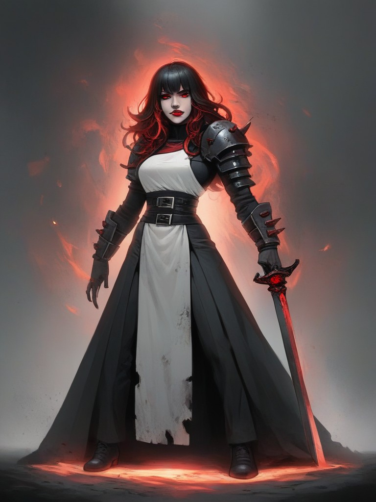
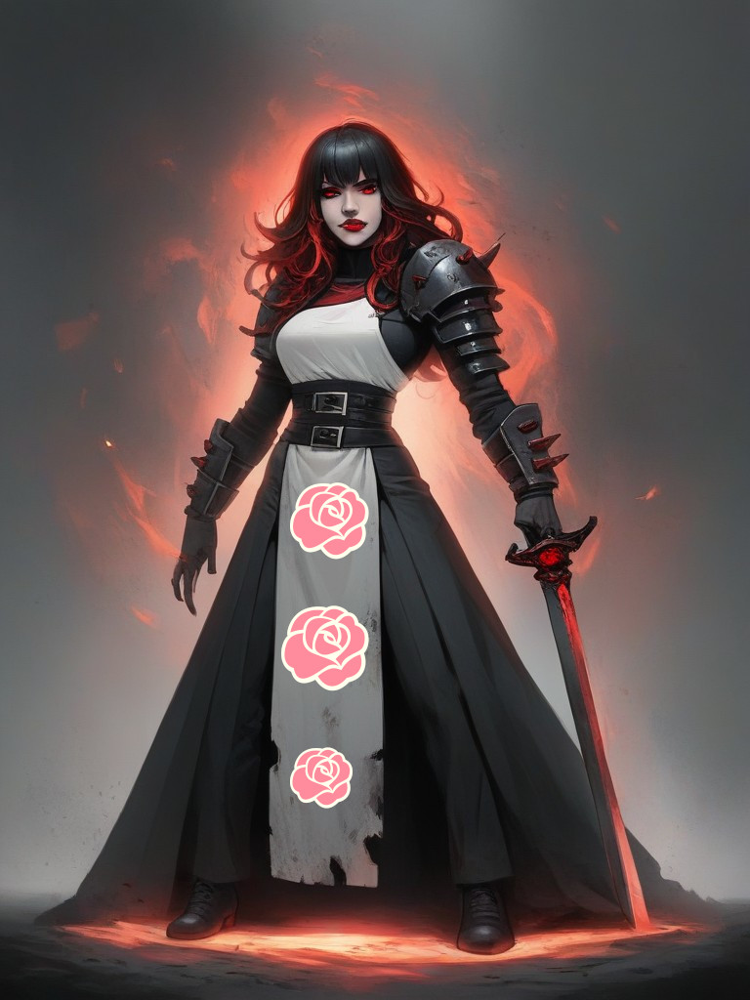

# Img2Img & resize

Сгенерируем более-менее хороший арт с необходимой позой, а все остальное допилим в Img2Img:

<figure><figcaption></figcaption></figure>

Выглядит ужасно, поэтому увеличиваем размер и гоняем по кругу.

<figure><figcaption></figcaption></figure>

 

<figure><figcaption></figcaption></figure>

 

<figure><figcaption></figcaption></figure>

В промежутках можно в "паинте", что-то дорисовывать и править, загонять в SD и получать результат.

<figure><figcaption></figcaption></figure>

 

<figure><figcaption></figcaption></figure>

 

<figure><figcaption></figcaption></figure>

В любом случае артефакты могут остаться, для этого есть постобработка - [**Detailer**](detailer.md)

