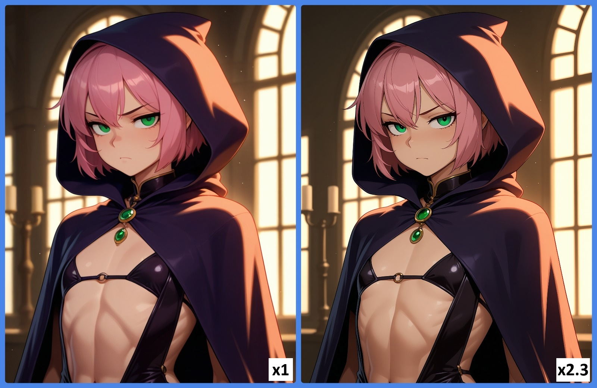

# Пример работы с Illustrious

Есть много вариантов моделей SD1.5, SDXL, Pony и т.д. Но на данный момент (март 2026г.) остановился на Illustrious. В чем была проблема с Pony и SD1.5 - **контроль генерации из-за большого кол-ва Lora**. Если просто генерировать базовое изображение (text2img) то все неплохо. Но как только увеличиваешь разрешение и детальность через img2img - происходит "размыливание" и как бы не пытался тыкать upscaler-ы и промты - все плохо.

Поэтому решил попробовать Illustrious - [WAI-illustrious-SDXL](https://civitai.com/models/827184/wai-illustrious-sdxl). Есть еще [NoobAI](https://civitai.com/models/833294/noobai-xl-nai-xl), но мне вообще не понравилось.

<figure><figcaption></figcaption></figure>

### Скриншоты из SD.Next

#### Text2Img

<figure><figcaption>
Text2img настройки. Обязательно надо работаь с Euler.
</figcaption></figure>

#### Img2Img

<figure><figcaption></figcaption></figure>

<figure><figcaption>
Метод апскейла указан в документации модели.
</figcaption></figure>

<figure><figcaption></figcaption></figure>

### Проблема SD.Next

1. В старых версиях я не помню такой пункт как `Refine`. Если она включиться, то ресайз не работает.
2. Куча мусора в логах от HIP/Rocm. Возможно из-за Win11 + HIP 7.1.
   1. `MIOpen(HIP): Error [C:/home/runner/_work/TheRock/TheRock/rocm-libraries/projects/miopen/src/include\miopen/conv/heuristics/ai_heuristics.hpp:62] Unable to load file: gfx908_metadata.tn.model Buffered 14 messages to file: WIN-JPTUV103UHO:C:\Users\user\AppData\Local\Temp\miopen_error_4764.log`
3. ...

