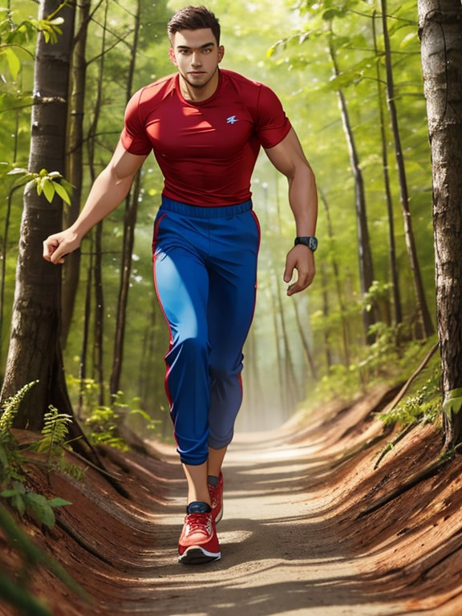

# Text2Img

По сути вся генерация построена на тегах.\
Promnt: `man, red t-shirt, blue sports trousers, run in forest, full length`\
Negative promt: `easynegative, ng_deepnegative_v1_75t`

<figure><figcaption></figcaption></figure>

В негаnивных указываются правки, которые хотите избежать - но в моем случае это готовые подборки `./models/embeddings` :





Допустим нам не нужны длинные штаны и указываем в _**negative promt**_ - `long sports trousers`

<figure><figcaption></figcaption></figure>

Иногда надо выделить тег (или набор тегов). Для этого используют скобки:

* ((тег)) - чем больше скобок тем важнее тег - `1man, in gym, (muscularity)`
* (тег: 1.0) - можно указывать весы и числами - `1man, in gym, (muscularity: 0.1)`

<figure><figcaption></figcaption></figure>

Есть еще теги в квадратных скобках - хз как работает.\
PS. Девочку уже добавила модель сама 0\_о

`animal, [cat: dog: 0.9]`

<figure><figcaption></figcaption></figure>

`animal, [cat: dog: 0.1]`

<figure><figcaption></figcaption></figure>
