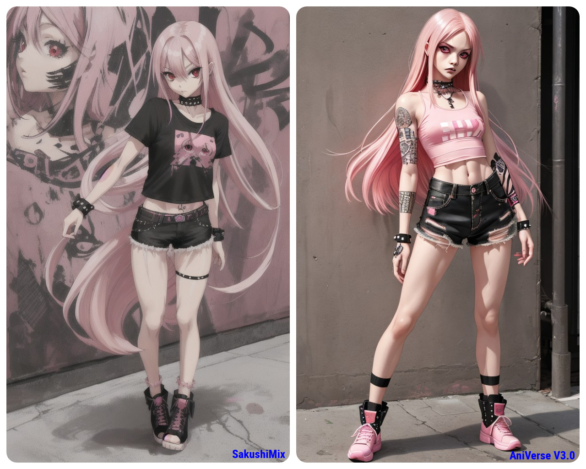
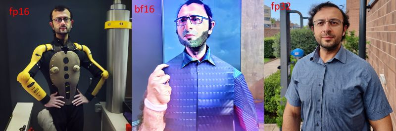
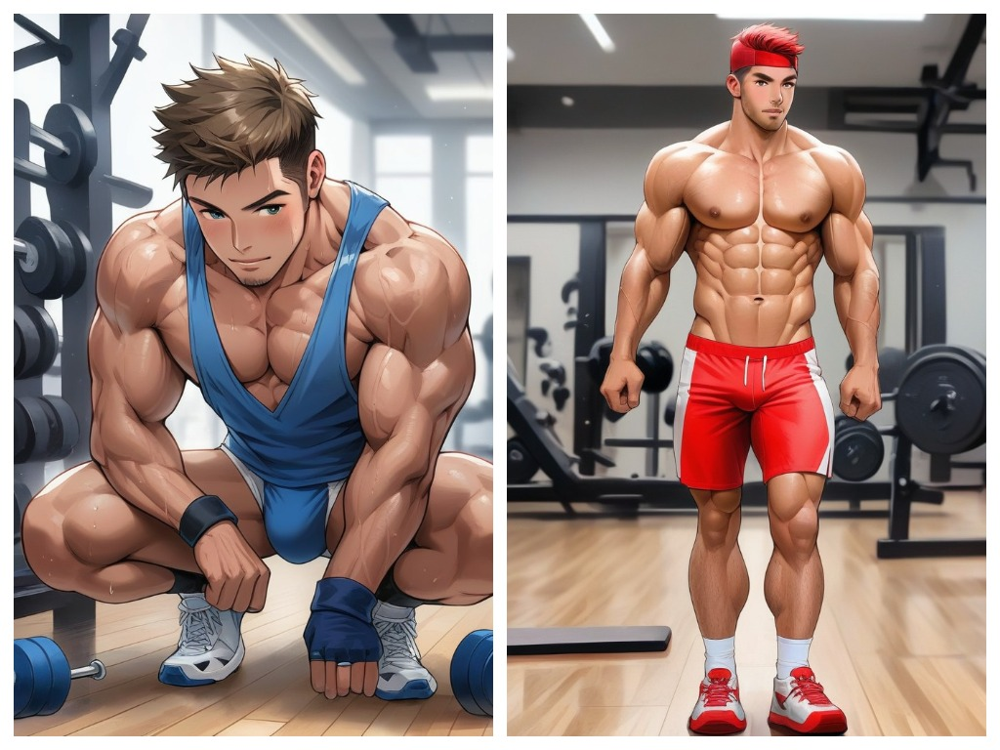

# Models, VAE и LoRA

## Model

* Файл с обученной моделью, по которой будут генерироваться изображения.
  * SakushiMix: [https://civitai.com/models/78056/sakushimix-finished](https://civitai.com/models/78056/sakushimix-finished)
  * AniVerse: [https://civitai.com/models/107842?modelVersionId=428028](https://civitai.com/models/107842?modelVersionId=428028)

<figure><figcaption></figcaption></figure>

* Формат:&#x20;
  * **ckpt (pickle tensor)** - это стандартный формат для моделей, которые мы используем с SD. Их минус в том, что при желании в файл можно запихнуть вредоносный код.
  * **safetensors (safetensor)** - доработанный формат для моделей, суть существования которого в том, чтобы нельзя было засунуть в модель что-то вредное. Также модель в этом формате грузиться быстрее чем модель в формате **ckpt**.
*   Битность расчетов - **fp16/fp32/bf16**

    * Чем больше тем точнее расчеты, но нужно больше памяти

    <figure><figcaption>
Но не все так прекрасно как на картинке :)
</figcaption></figure>

    * Мой тест - разница ну ХЗ

    <figure><figcaption>
Слева fp16,справа fp32
</figcaption></figure>
* **EMA** и **no-EMA** (Exponential Moving Averaging)- весы обучения, основывалось ли тренировка на предыдущих результатах.
* **Pruned** - как понял, облегченная модель.
* **VAE** (Variational AutoEncoder) - модель для img -> latent space -> img, где в латентном состоянии нейросети ищет пересечение, обрабатывается и перегоняется опять в изображение.
  * Подробнее: [https://youtu.be/Afw-Edl61w0](https://youtu.be/Afw-Edl61w0)

## LoRA

Это небольшие обученные модели для Stable Diffusion, которые вносят дополнительные изменения в генерацию изображений и используются вместе со стандартными моделями.

## Источники

* Model:&#x20;
  * [https://dtf.ru/howto/1868999-vse-chto-nuzhno-znat-pro-modeli-stable-diffusion-chast-1](https://dtf.ru/howto/1868999-vse-chto-nuzhno-znat-pro-modeli-stable-diffusion-chast-1)
  * [https://dtf.ru/howto/1890976-vse-chto-nuzhno-znat-pro-modeli-stable-diffusion-chast-2](https://dtf.ru/howto/1890976-vse-chto-nuzhno-znat-pro-modeli-stable-diffusion-chast-2)
* Lora:
  * [https://vk.com/@mystablediffusion-stable-diffusion-chto-takoe-modeli-lora-i-kak-ih-ispolzovat](https://vk.com/@mystablediffusion-stable-diffusion-chto-takoe-modeli-lora-i-kak-ih-ispolzovat)
